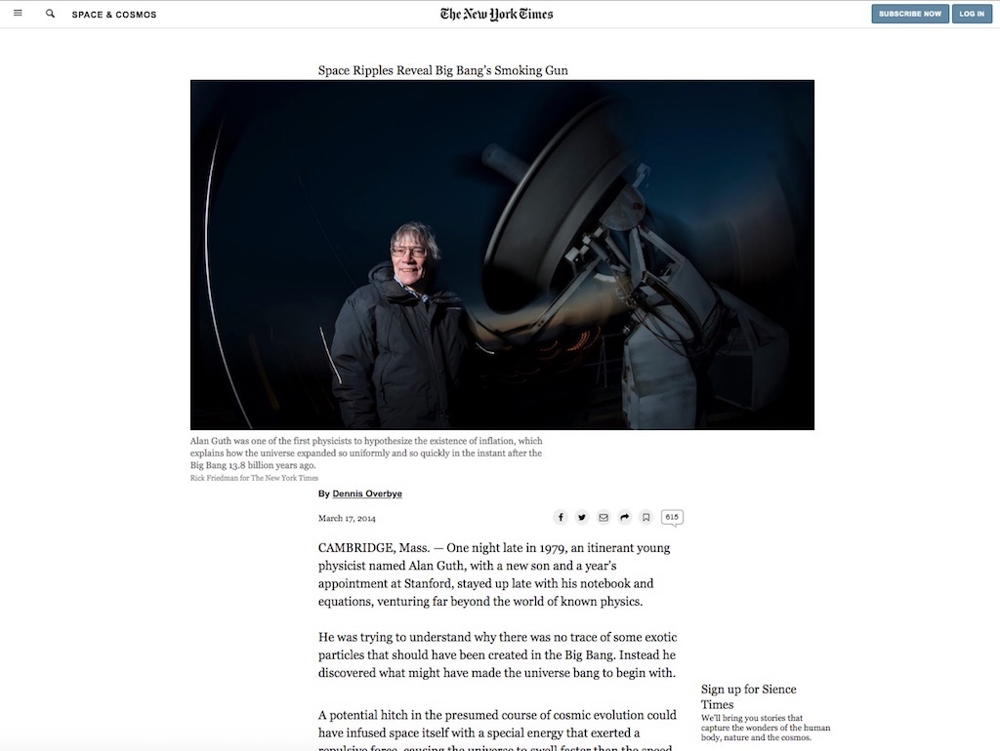

# Positioning and Floating Elements

## Microverse 3rd project

## NYT Article Clone Website

The New York Times has been a leader in experimenting with the inclusion of multimedia content in traditional stories. That creates all kinds of interesting position questions.So in This repository contains a copy of the New York Times article.

Used:
 * CSS FlexBox
 * HTML5
 * CSS Grid
 
## Authors

 * Neto daniel Zinga https://github.com/dannyclever
 * Nick Haralampopoulos https://github.com/macnick

## Screenshot

 

## The Website

Follow the link to acess to the Website: https://macnick.github.io/NYT-article/
